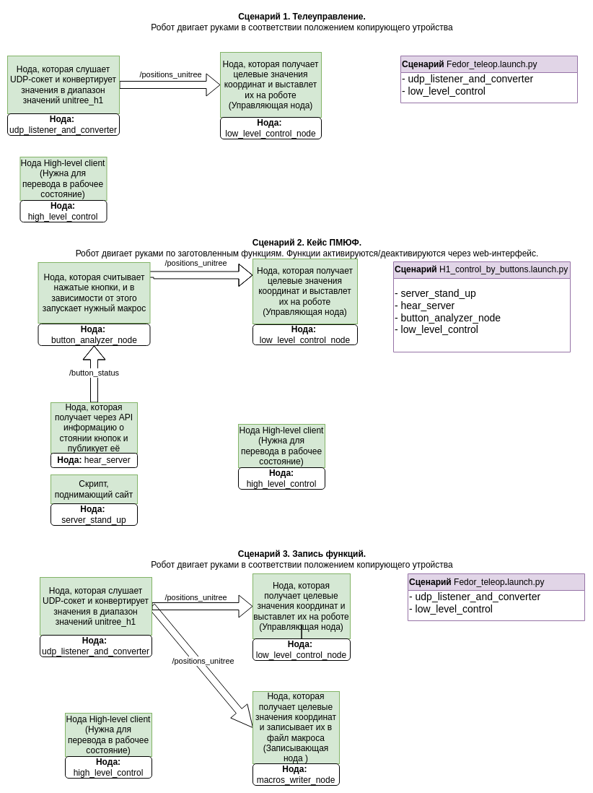

# Описание
В данном репозитории лежат пакеты для ROS2 предназначенные для расширения функционала робота Unitree H1.
# Зависимости 
- [Unitree_sdk2_python](https://github.com/unitreerobotics/unitree_sdk2_python)
- [Unitree_sdk2](https://github.com/unitreerobotics/unitree_sdk2)

# Установка зависимостей
## Unitree_skd2_python
```bash
cd ~
sudo apt install python3-pip # Установка pip, если его нет
git clone https://github.com/unitreerobotics/unitree_sdk2_python.git
cd unitree_sdk2_python
pip3 install -e . # Установка
```
## Unitree_sdk2
```bash
cd ~
git clone https://github.com/unitreerobotics/unitree_sdk2.git
cd unitree_sdk2
mkdir build
cd build
cmake ..
sudo make install # Установка в систему
```

# Перед запуском нод
Все действия с роботом, реализованные с помощью данных пакетов. **не требуют перевода его в режим разработчика**. 
Но для корректной работы нод, управляющих движением рук, **необходимо перевести робота в режим балансирования**. 
Сделать это можно как с пульта (см. в другой [методичке]() - позже появится ссылка ) или через клиент, последовательно выполнив действия:
1. `damp`
2. `stand_up`
3. `start`
## **Важно!!!** 
Первые 2 пункта робот должен выполнять в воздухе (в подвешенном состоянии) - чтобы ничего не мешало его движениям. Перед выполнением последнего пункта необходимо опустить робота, чтобы его ноги сопрbкоснулись с полом и встали на него полностью. Последняя функция активирует режим балансирования - робот будет перебирать ногами, до тех пор пока не установит равновесие.

# Как собрать и запустить
```bash
mkdir -p ~/extentions_for_h1_ws/src
cd ~/extentions_for_h1_ws/src
git clone https://github.com/cyberbanana777/extentions_for_h1.git .
```
Далее необходимо собрать бинарники из исходиков для оного из пакетов.
```bash
cd ~/extentions_for_h1_ws/src/hands_init/resource/comminication_oack/build
cmake .. -DCMAKE_BUILD_TYPE=Release
make
```
Далее нужно открыть файл `~/.bashrc` в вашем любимом текстовом редакторе и закомментрировать строчку `source /opt/ros/foxy/setup.bash`. После сохранения этого файла, этот терминал можно закрыть. Также нужно открыть новый терминал и выполнить следующие команды
```bash
cd ~/extentions_for_h1_ws
colcon build --packages-select cyclonedds
```
Далее нужно ещё раз открыть файл `~/.bashrc` в вашем любимом текстовом редакторе и раскомментрировать строчку `source /opt/ros/foxy/setup.bash`. После сохранения этого файла, нужно выполнить следующие команды
```bash
source ~/.bashrc # Только для этого терминала, потом это делать не нужно
cd ~/extentions_for_h1_ws
colcon build
source install/setup.bash 
```
Данную процедуру (закомменчивание и раскомменчивание `source /opt/ros/foxy/setup.bash`) нужно проводить только при первом запуске. При последующих `colcon build` проводить данную процедуру не нужно.
Теперь можно пользоваться пакетами!
Для работы с функционалом пакетов выполните команду в терминале:
```bash
source ~/extentions_for_h1_ws/install/setup.bash
```

# Содержание репозитория:
## Краткое описание
 - Пакет **`button_analyzer`** - анализирует какая кнопка нажата и в зависимости от этого постит макрос-функцию, которая соответствует этой кнопке  
 - Пакет **`button_server`** - поднимает сайт и получает информацию с него
 - Пакет **`completed_scripts`** - launch-файлы, которые запускают определённые конфигурации нод
 - Пакет **`cyclonedds`** - для нормального обмена сообщениями в системе H1
 - Пакет **`hand_init`** - поднимает low-level передачу координат на модули рук 
 - Пакет **`high_level_control`** - управление high-level командами для перевода робота в различные режимы 
 - Пакет **`low_level_control`** - задание кастомного положения робота через low-level команды (посылками наборов координат)
 - Пакет **`macros_writer`** - позволяет записать макрос для движений робота с помощью копирующего устройства (от Фёдора)
 - Пакет **`rmw_cyclonedds`** - для нормального обмена сообщениями в системе H1
 - Пакет **`udp_listener_and_converter`** - получает координаты с копирующего устройства и переводит в координаты H1
 - Пакет **`unitree`** - для нормального обмена сообщениями в системе H1. Содержит структуры сообщений

## Подробное описание
### Пакет button_analyzer
Пакет предназначен для анализа нажатых кнопок, которые постятся в топик `/button_status` нодой, которая запускается зависимостью `hear_server` из пакета `button_server`, и в зависимости от того какая кнопка нажата - постит тот или иной макрос (циклограмму заранее записанного движения) в топик `/positions_to_unitree`.  Запись макросов возможна с помощью зависимости `macros_writer` из пакета `macros_write`.
#### Запуск button_analyzer ноды 
```
ros2 run button_analyzer button_analyzer
```

### Пакет button_server
Пакет предназначен для управления роботом Unitree H1 кнопками на web-интерфейсе.
Скрипты, реализованные в этом пакете:
#### Запуск сервера
Поднимает сайт с кнопками, которые можно нажимать
```
ros2 run button_server server_stand_up
```
#### Запуск слушателя сайта
Запускает ноду, которая обращается по API к серверу и получает информацию о состоянии кнопок. Нода публикует информацию об активной кнопке (или её отсутствии) в топике `/button_status`
```
ros2 run button_server hear_server
``` 

### Пакет completed_scripts
Пакет содержит launch-файлы, позволяющие запускать несколько нод одновременно по заготовленным сценариям:
#### Сценарии
##### Повторение положения рук копирующего устройства роботом H1 
```
ros2 launch completed_scripts Fedor_teleop.launch.py
```
Руки H1 будут принимать такое же положение, как и копирующее устройство от Фёдора. (Предварительно на машине, к которой подключено копирующее устройство, должна быть запущена unity-программа-визуализатор (в программе необходимо нажать кнопку "Out control" и ползунок ниже установлен на 0.100, не активируя галочку возле ползунка))
Запускает следующие ноды:
- `upd_listener_and_converter`
- `low_level_control`
##### Управление расширенным функционалом Unitree_H1
```
ros2 launch completed_scripts H1_control_by_buttons.launch.py
```
Запускает сценарий управления роботом, с помощью кастомных заранее записанных макросов, через web-интерфейс.
Ноды, которые запускаются в скрипте:
- `server_stand_up`
- `server_hear`
- `low_level_control`
- `button_analyzer`

### Пакет hand_init
Пакет позволяет создать топики для работы с модулями рук  `inspire hand`. После запуска появляются топики `/inspire/cmd` и `/inspire/state`. В топик `/inspire/cmd` постятся управляющие команды, а из топика `/inspire/state` можно получить feedback-информацию. 
#### Запуск high-level клиента 
```
ros2 run hand_init hand_init
``` 

### Пакет high_level_control
Пакет предназначен для управления роботом Unitree H1 с помощью high-level команд (переключение режимов как с пульта). Скрипт клиента необходимо **запускать вручную**, т.к. он требует постоянного ввода.
#### Запуск high-level клиента 
```
ros2 run high_level_control high_level_control
``` 

### Пакет low_level_control
Пакет предназначен для управления роботом Unitree H1 с помощью low-level команд, команда представляет собой словарь, где ключи – номера моторов, а значения – угол поворота. Словари приходят как JSON-пакет от ноды `button_analyzer` или `upd_listener_and_converter`. В пакете реализовано 2 программы - одна запускает руки  без кистей и пальцев и другая - руки полностью. При работе тип `low-level` должен совпадать с типом `udp_listener_and_converter`. 
#### Запуск low-level ноды без кистей и пальцев
```
ros2 run low_level_control low_level_control_without_hands
``` 
#### Запуск low-level ноды c кистями и пальцами
```
ros2 run low_level_control low_level_control_with_hands
``` 


### Пакет macros_writer
Пакет предназначен для записи информации (движения рук копирующего устройства) из топика в файл. Позволяет написать последовательность координат в файл, тем самым запивав макрос, который можно будет "воспроизвести" на роботе Unitree H1 с помощью low_level ноды. Скрипт необходимо **запускать вручную**, т.к. он требует  ввода имени файла и директории сохранения.
#### Запуск macros_writer ноды 
```
ros2 run macros_writer macros_writer
```
### Пакет udp_listener_and_converter
Пакет предназначен для чтения udp-сокета, т.е. получений углов поворота с копирующего устройства от робота Фёдора, конвертирования углов из диапазона копирующего устройства в диапазон углов unitree_H1 и отправки их в топик `/positions_to_unitree`. В пакете реализовано 2 программы - одна запускает руки  без кистей и пальцев и другая - руки полностью. При работе тип `low-level` должен совпадать с типом `udp_listener_and_converter`. 
#### Запуск udp_listener_and_converter ноды без кистей и пальцев 
```
ros2 run udp_listener_and_converter udp_listener_and_converter_without_hands
```
#### Запуск udp_listener_and_converter ноды c кистями и пальцами
```
ros2 run udp_listener_and_converter udp_listener_and_converter_with_hands
```
### Пакет (служебный) unitree 
Пакет поставляется производителем робота unitree H1 и интегрирован в этот репозиторий для удобства. В нём описаны типы сообщений, которые используются в роботе unitree H1.
### Пакеты (служебные) cyclonedds и rmw_cyclonedds
Эти пакеты необходимы для работы без ошибок DDS (data distibution system) ROS2.


# Ссылки на другие ресурсы по теме
- [Установка служебных пакетов](https://github.com/unitreerobotics/unitree_ros2) (которые уже интегрированы в этот репозиторий) описана 
- [Информация о модуле рук от производителя Inspire hands](https://support.unitree.com/home/en/H1_developer/Dexterous_hand)
- [ROS2 docs](https://docs.ros.org/en/foxy/)
- [Работа с копирующим устройством от робота "Фёдор"](https://github.com/cyberbanana777/UKT_MIREA_ROBOT)

# Запуск
Использование пакетов возможно несколькими способами:
 - **Запуск launch-файлов.** Этот метод позволит запустить несколько нод одновременно из одного терминала. Подходит для работы уде отлаженной системы.
 - **Запуск отдельных нод.** Этот метод хорош для использования конкретных нод или в случает отладки

# Карта нод и топиков

# Предложения и корректировки
Если Вы нашли ошибку, неточность, у Вас есть предложения по улучшению или вопросы, то напишите в телеграмм [сюда](https://t.me/Alex_19846) (Александр) или [сюда](https://t.me/Kika_01) (Алиса).
